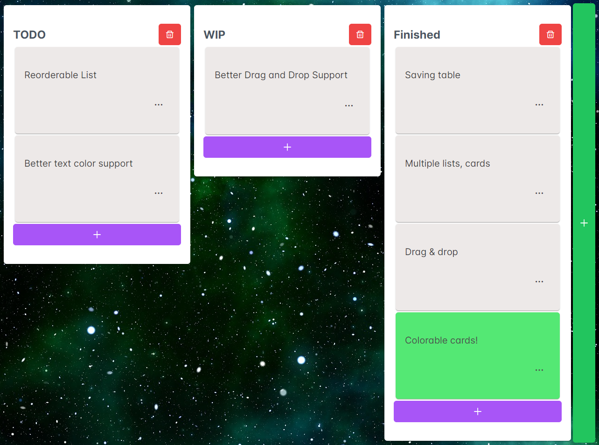

# TodoProject

Very simple Kanban TODO project made in Angular with PrimeNG based on Trello.

Table is saved in cookies

Live demo at [todo.robi.zip](https://todo.robi.zip)

## Features
- Saving table locally
- Multiple lists and cards
- Drag and drop between lists
- Colorable cards
- Card Description, Assigned Member
  - Assigned Member Filter 

## Missing features
- Reorderable lists
- Better drag and drop support
  - Reorderable list
  - Preview (like in Trello)
  - Better visuals (Dragged element follows mouse)
  - Mobile support
- Better text color support
  - Currently the text is barely visible when the background color's value is around 0.5
- Better scroll bar
  - Scrollbar should be per list instead of the whole page
- Select all, unselect all menubar
  - Both for cards and Filter 

## Considered ideas
- Multiple tables (should be easy to do)
- Custom background image (store base64 of image in cookies?)
- Export, import table(s)
- Advanced (optional) cards
  - Deadline support
  - TODO Check List with Progress Bar
- Multiple instance support
  - Due to the way saving works, it resaves the entirety of the current page instead of only the changes
  - This would only be a large issue if the project supported collaborative work between multiple users
  - To solve, save only the changes
